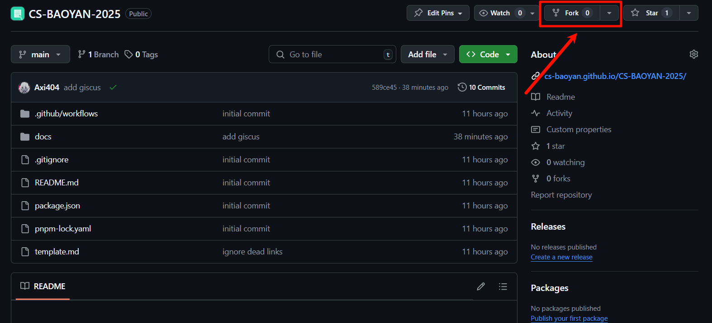
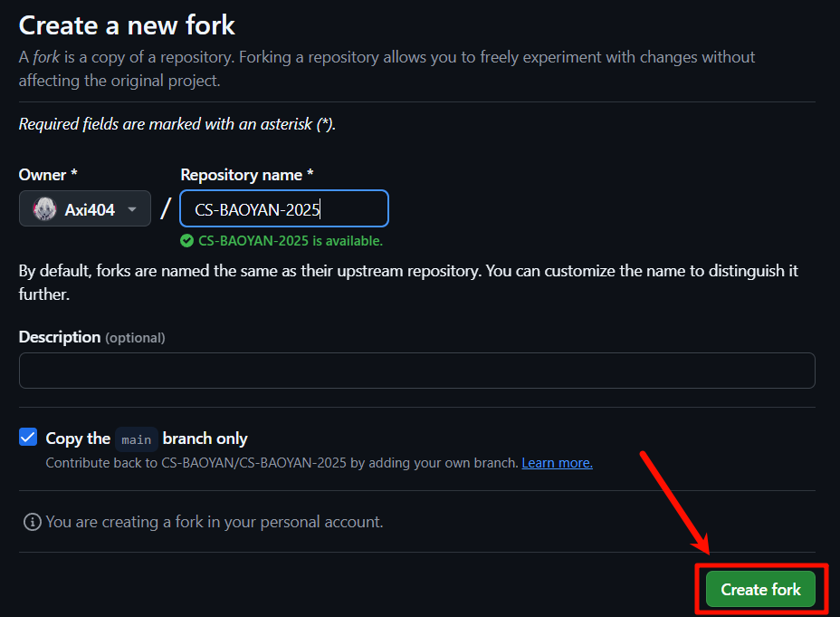
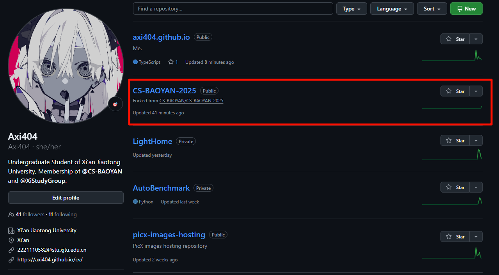
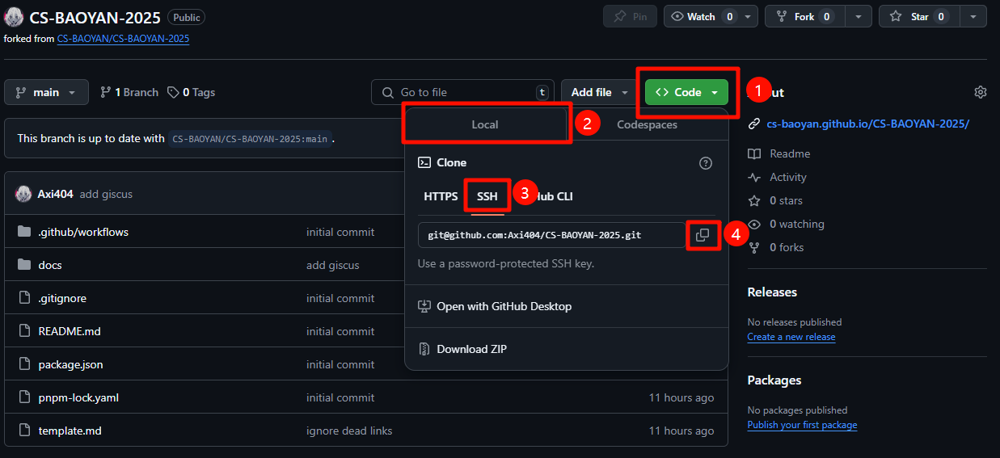
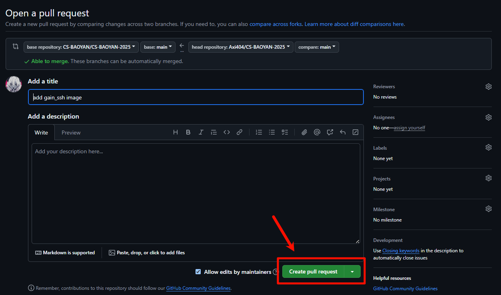

# 贡献指南

[[TOC]]

## 贡献流程

贡献指南是关于 CSBAOYAN2025 相关内容的贡献指南，其中指引不同技术水平的撰写者完成对于 CSBAOYAN2025 内容的贡献。

本部分将讲解详细的贡献流程，其中包括的前置技能有 <u>Git 的使用</u>以及 <u>Markdown 的撰写</u>。相关技能的初步了解可以前往 [廖雪峰的 Git 教程](https://www.liaoxuefeng.com/wiki/896043488029600) 以及 [Markdown 官方教程](https://markdown.com.cn/basic-syntax/) 进行学习。

### 注册 Github 账号

作为贡献者，首先需要注册 Github 账号，这一步十分的简单，前往 [Github 官网](https://github.com/) 并点击 `Sign Up`，根据要求进行注册即可，在这里并不进行过多的讲解。

### 初始化本地 Git 并配置 SSH

在 [Git 官网](https://git-scm.com/) 选择下载 Windows 版本并按照提示进行安装。


在安装中需要注意的是：

- 在 `Select Components` 中选择 `Git LFS`，按需求安装其他组件。
- 在 `Adjusting the name of the initial branch in new repositories` 中可以选择 `Override the default branch name for new repositories` 并将主分支命名为 `main`（貌似是因为原默认名称 `master` 涉及种族歧视，如今 Github 默认分支为 `main`，最好保持一致）。
- 在 `Adjusting your PATH environment` 中选择 `Recommended` 的选项。
- 其他内容选择默认选项即可，或者在互联网进行查询。

安装之后首先设置 Git 的基本信息：

```shell
git config --global user.name "Your Name"
git config --global user.email "Your Email"
```

之后需要配置 SSH，首先需要检查是否已经存在 SSH 密钥，如果存在则跳过此步骤，否则需要进行创建：

```shell
ssh-keygen -t ed25519 -C "Your Email"
# 或者使用 ssh-keygen -t rsa -C "Your Email"
cat ~/.ssh/id_ed25519.pub
# cat ~/.ssh/id_rsa.pub
```

将生成的密钥复制到 Github 中的 `Settings` 中的 `SSH and GPG keys` 中的 `New SSH key` 并粘贴。

此时本地理论上已经可以进行 Git 的 push 等操作到远程储存库了。

### Fork 本仓库

进入本仓库的 [Github 主页](https://github.com/CS-BAOYAN/CS-BAOYAN-2025)，点击 `Fork` 按钮，即可将本仓库 Fork 到自己的 Github 账号下。





Fork 操作本质上是复制了一份本仓库到自己的账号下，并在自己的账号下享有修改的权限，同时可以比较自己账号下的仓库与上游仓库之间的更改差别，Fork后的仓库可以在自己账号的 Repositories 中看到。



### 克隆仓库

在 Fork 完成之后，在自己 Fork 的仓库中，找到并点击 `< > Code` 按钮，之后点击 `SSH` 按钮，并复制链接。



在本地找到适合保存本项目的文件夹，右键资源管理器，点击 `在终端中打开`，并进行克隆操作。

```shell
git clone your_ssh
```

::: warning
对于之前没有运行过 `git clone` 或者运行 `ssh git@github.com` 的用户，很可能会出现信息提示：

```text
The authenticity of host 'github.com (xxx.xxx.xxx.xxx)' can't be established.
xxxxxxx key fingerprint is sHA256:xxx.
This key is not known by any other names.
Are you sure you want continue connecting(yes/no/[fingerprint])?
```

需要明确输入 `yes` 并回车，否则无法正确建立连接。
:::

### 仓库文件结构

在克隆完成之后，可以使用 [VSCode](https://code.visualstudio.com/) 等编辑器打开文件夹并进行编辑，其中首先需要了解的是文件的结构：

```txt
├───.github
├───docs
│   ├───.vitepress
│   │   ├───cache
│   │   └───theme
│   ├───images
│   ├───public
│   ├───folders
│   └───index.md
├───node_modules
├───.gitignore
├───package.json
├───pnpm-lock.yaml
└───tsconfig.json
```

其中例如 `.gitignore`, `package.json`, `pnpm-lock.yaml`, `tsconfig.json` 均为 Git 以及 Node.js 的相关配置文件，无需过于调整。`docs` 文档中包含 `.vitepress` 内容，此为 VitePress 的配置文件所在的文件夹，而其他的文件夹则按照文档的组织进行排序，其中本项目中全部的图片均维护在 images 文件夹中，而 logo 等资源则维护在 public 文件夹中。

### 安装 NodeJS

前往 [NodeJS 官网](https://nodejs.org/zh-cn/download/prebuilt-installer) 下载预构建安装程序，之后运行并进行安装即可，在这里不进行赘述。

在安装之后进入 Shell 并查看 NodeJS 版本并安装 pnpm：

```shell
node -v
npm -v
npm install -g pnpm
```

对于 Ubuntu 则可以使用：

```bash
sudo apt install nodejs
sudo npm install n -g
sudo n 20.16.0
npm -v
node -v
# 如果为 20.16.0 则执行，否则重启终端或者尝试执行 hash -r
npm install -g pnpm
```

### 构建项目

在项目根目录下打开终端并运行：

```shell
pnpm i
pnpm dev
```

第一行进行依赖的安装，第二行进行项目的运行，此时可以在本地访问网页，具体 url 见终端输出。

### 撰写文档

在了解了文件结构之后便可以开始撰写文档了，确认自己想要撰写的文档所隶属于的类别，并进入该文件夹，新建一个 Markdown 文档，按照 Markdown 文档的语法进行撰写。

与此同时值得注意的是，VitePress 支持部分的 Markdown 拓展语法，这些内容可以在 [官方文档](https://vitepress.dev/zh/guide/markdown) 中查阅。

撰写文档之后进行保存即可。在这里需要注明的是，在 VitePress 中使用图片的插入，所使用的相对路径是相对于 Markdown 文档本身的相对路径，而非相对于项目根目录的相对路径。

### 提交更改

在完成了文档的修改之后，可以使用 Git 进行更改的提交：

```shell
git pull origin main
git add .
git commit -m "your commit message"
git push origin main
```

之后可以看到自己的更改已经提交到了自己的 Github 仓库中。

### 发起 Pull Request

假如说进行了成功的提交，可以注意到，自己的仓库中应显示如 `1 commit ahead of` 的字样。点击 `Contribute` 并点击 `Open pull request` 即可发起一个 Pull Request，并等待管理员进行审核。


请确保 PR 的 title 中表意明确，同时 description 中清晰描述了自己添加的内容，之后点击 `Create pull request` 即可，管理员在收到内容之后会进行审查并给出 `comment` 或直接将你的 PR Merge 进主分支，即完成了贡献。



### 完成贡献

进行了上述的内容，便成功完成了一次贡献，你的内容将保留在 CABAOYAN2025 中，并为后来者指引方向。

## 保研经验贴贡献流程

贡献者可以在 `/docs/保研经验贴/2024年` 中新开一则 Markdown 文档，并按照 Markdown 的语法进行撰写，并使用上述流程进行投稿；或者已经在其他平台进行了投稿的，可以在 `/docs/保研经验贴/2024年/index.md` 文档中添加自己的链接。

对于新开 Markdown 文档，需要按照以下格式：

- **标题**：标题自拟，但需要与文档内容相关，尽量包含个人昵称等，以免命名冲突。至少需要包含一个一级标题，为文档标题，其余标题至多为二级标题。
- **文件命名**：文件名需要与标题一致，例如 `阿汐2024年保研记录.md`。
- **图片等**：一般来说建议使用图床等方式插入图片，笔者曾有 [使用 Github 搭建图床的记录](https://axi404.top/posts/Tech-Talk/MISCs/ImageBed)，供参考。

对于添加链接的方式，需要按照格式：`* @[你的昵称](你的主页或者社交平台链接)的[文章标题](文章链接)` 进行添加，这类内容在 `/docs/保研经验贴` 的往届内容中均有示例，请参考。

## 致全体贡献者

感谢每一位贡献者的辛勤贡献，你们均无私地将信息进行了开源分享，这有助于未来的每一位保研er更好地求学，并前往更好的地方，更好的提升自我，向你们每一位致以最诚挚的感谢。